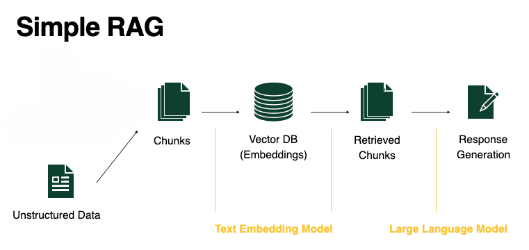
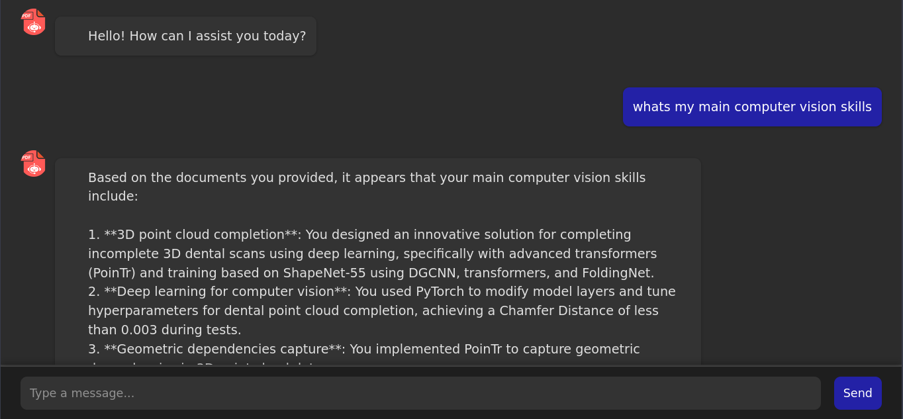

#  PDF Retriever : AI-Powered Document Query System

## Overview



This project is designed to make searching through large collections of PDF documents fast, intelligent, and efficient. Instead of manually reading through pages to find information, it automates the process using AI-powered techniques.

First, it extracts text from PDFs while keeping track of where each piece of information comes from. Then, it breaks the text into manageable chunks and converts them into numerical representations (embeddings) so they can be efficiently searched. These embeddings are stored in a specialized database (FAISS) that allows for quick and accurate retrieval based on meaning, not just keywords.

When a user asks a question, the system finds the most relevant pieces of text and feeds them into an advanced AI language model. This model then generates a well-formed answer, using the retrieved content as context.

By combining text extraction, semantic search, and AI-driven language understanding, this system provides precise, context-aware responses, making it ideal for research, knowledge management, and document analysis.


## Usage

To start the Uvicorn server, run the following command in the root directory:

```
uvicorn app:app
```
Then, navigate to `src/gui` and open `index.html` to start interacting with the chatbot.

Note:

- Ensure you have placed your PDF documents in the `/doc` folder.
- Obtain your Groq API key to access the open-source LLM and add it to `config.yaml`.




## Rquirements

- PyMuPDF
- faiss-cpu
- pickle-mixin
- langchain
- sentence-transformers
- groq
